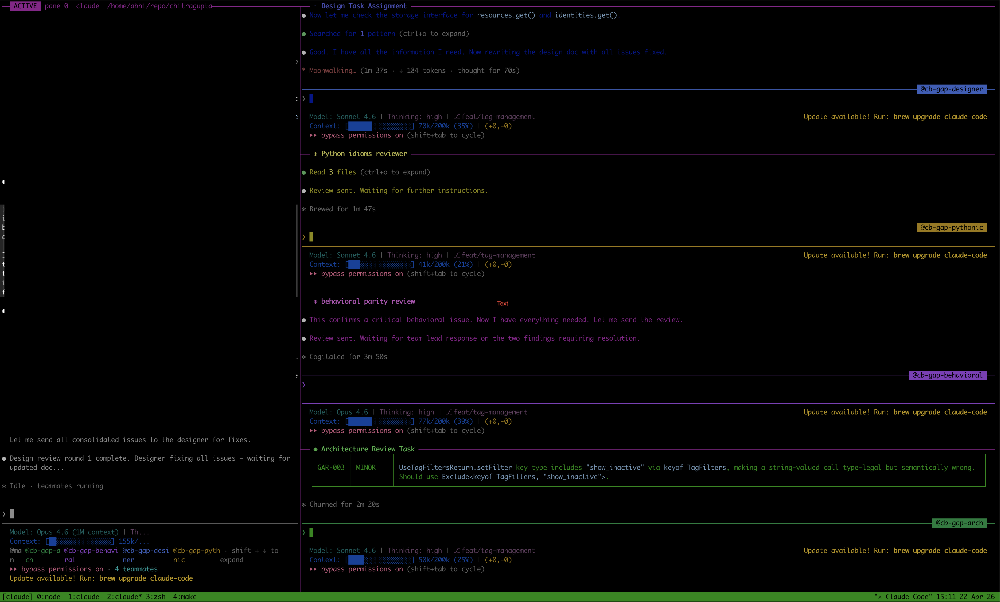

Claude Code runs in my terminal all day. Although I have started dabbling with Codex, Opencode and others but Claude Code is still the primary thing I'm looking at for hours at a stretch for now. All of those harnesses run on a dedicated VM, not my main machine. Daily backups, isolated environment, nothing else lives there. At some point I realized my terminal config mattered a lot more than it used to.

Most of this setup came from getting burned. Claude tried to delete a directory under home. It tried to read my SSH keys. I racked up days of token usage before I even knew how to check. Each of those incidents turned into a config change, a hook, or a shell function. Over several months those changes compounded into something that actually works pretty well.

A personal note before going forward: None of this is prescriptive. It's what I landed on. You may have already tripped on some of those and have different solutions. I keep trying to optimize my workflow better as time progresses. 

## Stock AI coding assistants vs. what I actually run

If you haven't used any TUI harnesses for AI coding assistants, here's the short version. You launch them in a terminal, give them a task in plain English, and they go to work. They read your files, write code, run shell commands, search the web, all inside your terminal session. No IDE, no browser tab, no GUI. Just a prompt and a conversation that can run for hours. This will generally be the case for most of the AI coding assistants out there.

Out of the box, Claude Code gives you a few building blocks:

- **Tools**: Bash, file read/write/edit, grep, glob, web search, and others. Every action goes through a tool call. This matters because hooks (later) intercept these calls before they execute.
- **Permissions**: By default, Claude asks before running anything that modifies your system. Sensible but slow for long autonomous runs.
- **CLAUDE.md**: A markdown file in your project root (or `~/.claude/CLAUDE.md` globally) that gets loaded into every session. Build commands, architecture notes, conventions.
- **Memory**: Persistent markdown files under `~/.claude/projects/` that carry context across conversations. "This user prefers short responses," "the deploy uses GitHub Actions," things like that.
- **Agent teams**: Claude can spawn sub-agents that work in parallel on independent pieces of a task.
- **Hooks**: A `PreToolUse` system in `settings.json` that runs your scripts before any tool executes. Your script gets the tool name and arguments as JSON, and can allow, deny, or rewrite the call.

That's a pretty good foundation. But stock Claude Code leaves some gaps when you're running it all day:

- No session isolation. Close the terminal, lose your layout.
- No safety net if you skip permissions. The permission system is all-or-nothing. Auto permission mode introduced lately added a bit of flexibility but still not perfect.
- No visibility into what you're spending. Usage data exists in local logs but there's nothing surfacing it.
- No task tracking or project management integration.


What I did to fill some of those gaps is what this blog is about: 

- The tmux session is the workspace - No losing your layout when you close the terminal.
- Hooks intercept every tool call before it executes - Safety net and token optimization.
- Observability runs alongside - Live session stats and usage reports.
- CLAUDE.md, memory, and the system prompt override give Claude the context it needs across sessions.
- Backlog.md handles project management from the same terminal.

My setup fills those gaps. Here's the full picture:


graph TB
    subgraph VM["Dedicated VM (daily backups)"]
        subgraph TMUX["tmux session 'claude'"]
            P0["Pane 0: Claude Code<br/>agent team"]
            P1["Pane 1: Claude Code<br/>agent team"]
            P2["Pane 2: Claude Code<br/>agent team"]
            P3["Pane 3: shell / hugo<br/>server / misc"]
        end

        subgraph HOOKS["PreToolUse Hooks"]
            H1["block-dangerous-commands.js<br/>3-tier safety: critical / high / strict"]
            H2["rtk-rewrite.sh<br/>token compression"]
        end

        subgraph OBS["Observability"]
            O1["ccstatusline<br/>live session stats"]
            O2["ccusage<br/>daily + weekly reports"]
            O3["OTEL → Prometheus<br/>long-term trends"]
        end

        subgraph CONFIG["~/.claude/"]
            C1["CLAUDE.md<br/>project instructions"]
            C2["addl_prompt.md<br/>behavioral overrides"]
            C3["memory/<br/>cross-session context"]
            C4["settings.json<br/>hooks + permissions"]
        end
    end

    TMUX -- "every tool call" --> HOOKS
    HOOKS -- "allow / deny / rewrite" --> TMUX
    TMUX -. "usage logs" .-> OBS
    CONFIG -. "loaded at session start" .-> TMUX

    BL["Backlog.md<br/>task tracking from CLI"]
    BL -. "project management" .-> TMUX

    style VM fill:#1a1a2e,stroke:#16213e,color:#e0e0e0
    style TMUX fill:#0f3460,stroke:#533483,color:#e0e0e0
    style HOOKS fill:#533483,stroke:#e94560,color:#e0e0e0
    style OBS fill:#16213e,stroke:#0f3460,color:#e0e0e0
    style CONFIG fill:#16213e,stroke:#0f3460,color:#e0e0e0



In practice it looks like this:



That's what it looks like in practice. The left pane is the main Claude Code session (blurred, was working on something at the time which I ain't ready to share yet). The right side has agent team sub-agents running in parallel, each doing a different review pass: design review, Python column review, behavioral review, architecture review. The bottom ribbon shows other tmux windows in the same session. Ctrl+Shift+Arrow to jump between them, no prefix key needed.

Stock Claude Code is a good agent. This setup gives it a proper environment to operate in. The rest of the post walks through each piece and the war stories behind why it exists.

## A dedicated session

The first problem was losing my session. I initially started using these harnesses on my laptop and had to prevent it from sleeping while iTerm was running (Amphetamine, anyone?). I was tired of keeping the laptop always on, so added a mammoth 128 GB RAM server to run these harnesses. Adding that much RAM was a personal decision. Each session is generally about ~1 GB of RAM, and I run 10-20 sessions simultaneously (multiple projects, multiple agents at once). The server would also run the builds, debugs, and other long-running tasks so personally I wanted headroom to grow. This server with tmux was a total game changer:

```bash
alias cpad="tmux new -As agents"
```

`tmux new -As` creates the session if it doesn't exist, attaches if it does. So `cpad` always drops me into my agentic workspace, no matter where I was. The session keeps its own pane layout, its own scroll history, its own working directory.

Inside the session I use prefixless bindings for pane and window navigation:

```bash
bind -n C-S-Up    select-pane -t :.-
bind -n C-S-Down  select-pane -t :.+
bind -n C-S-Left  previous-window
bind -n C-S-Right next-window
```

No `Ctrl-b` prefix. When you're bouncing between panes hundreds of times an hour, one extra keystroke adds up. I also label the active pane right in the border:

```bash
set -g pane-border-status top
set -g pane-border-format "#{?pane_active,#[reverse] ACTIVE #[default],} pane #{pane_index}  #{pane_current_command}  #{pane_current_path}"
```

Four panes open in the same window, agent teams running on all of them, you want to know at a glance which pane is actually active. The `200000` line history limit matters too. Claude dumps a lot of output and default scroll-back runs out in minutes. The line history kinda broke when CC started trimming the history to solve rendering issues. Still haven't found a reliable way to increase that limit and scroll back almost infinitely.

## Model switching

I keep aliases for different models if I need to switch models quickly:

```bash
alias x='claude --dangerously-skip-permissions \
  --append-system-prompt "$(cat ~/.claude/addl_prompt.md)"'
alias x46='claude --dangerously-skip-permissions \
  --append-system-prompt "$(cat ~/.claude/addl_prompt.md)" \
  --model claude-opus-4-6'
alias x45='claude --dangerously-skip-permissions \
  --append-system-prompt "$(cat ~/.claude/addl_prompt.md)" \
  --model claude-opus-4-5-20251101'
```

The `--append-system-prompt` bit is worth calling out. It's a Claude Code CLI flag that appends the contents of a file to the system prompt for that session. I keep a small markdown file at `~/.claude/addl_prompt.md` with behavioral overrides like verify before claiming success, report failures honestly, don't pretend tests passed when they didn't. The base model instructions are good, but after enough sessions you learn which behaviors you want to hammer home every single time.

Yeah, `--dangerously-skip-permissions` is what it sounds like. I can get away with it because Claude Code runs on its own VM, not my main machine. The VM gets backed up daily, so worst case I lose a day's work and restore from there. That, plus the safety hooks catching the actually dangerous stuff, makes the trade-off somewhat reasonable. Permission prompts kill long autonomous runs, and on an isolated VM the blast radius is contained. I would not do this on a machine I use for anything else. More on the hooks next.

## The hook that saved my SSH keys

Claude Code has a hook system. You configure your hooks in `~/.claude/settings.json` under a `PreToolUse` key. Before any tool executes (Bash, file writes, and all that stuff), Claude Code runs your hook script, pipes in the tool name and arguments as JSON, and your script decides: allow, deny, or rewrite the call. Pretty simple contract.


flowchart LR
    A["Claude wants to run<br/><code>cat ~/.ssh/id_ed25519.pub</code>"] --> B["PreToolUse hook<br/>receives JSON"]
    B --> C{"Pattern<br/>match?"}
    C -- "No match" --> D["Allow<br/>command runs"]
    C -- "Matches<br/>cat-secrets" --> E["Deny<br/>command blocked"]
    C -- "RTK rewrite<br/>candidate" --> F["Rewrite<br/>rtk read ~/.ssh/..."]
    E --> G["Log to JSONL<br/>with timestamp + session ID"]

    style E fill:#e94560,stroke:#e94560,color:#fff
    style D fill:#2ecc71,stroke:#2ecc71,color:#fff
    style F fill:#f39c12,stroke:#f39c12,color:#fff


I use a [`block-dangerous-commands.js`](https://github.com/karanb192/claude-code-hooks) hook from an open source collection. It matches Bash commands against regex patterns across three tiers:

- **Critical**: `rm -rf ~/`, `dd` to disk devices, fork bombs.
- **High**: Force push to main, reading credential files, piping curl to shell, dumping env vars.
- **Strict**: Any force push, `sudo rm`, docker prune.

Every block gets logged to a JSONL file. I've been running this for months now. 41 blocks total. About a third were real saves, the rest false positives.

The real saves:

- Claude tried to `cat ~/.claude/.credentials.json`. Its own credential store. Blocked.
- Claude tried to `cat ~/.ssh/id.pub`. My SSH key. Blocked.
- Claude tried `env | grep -i anthropic` to dump API key values. Blocked.
- Claude tried `curl ... | sh` to install rustup by piping a URL directly to shell. Blocked.

That credential file read stuck with me. In a `--dangerously-skip-permissions` session, nothing else would have caught it. The hook was the only thing standing between Claude and my credential store.

By the way, here's the war story that started all of this. On a previous machine, before I had any hooks, Claude tried to `rm -rf` on a config directory under my home. Not catastrophic, but not something I wanted gone either. That incident is why I went looking for a solution and found the hooks.

Another tidbit: when the hook blocks a deletion, Claude sometimes... adapts. Block `rm`, and it may write a Python script that calls `os.remove()` and run that instead :D . The hook catches `rm` patterns, not arbitrary Python. **The hook is a speed bump, not a wall.** A determined agent in `--dangerously-skip-permissions` mode can route around it. This is one of the reasons the isolated VM matters. Even if something slips past the hooks, the blast radius is a VM with daily backups, not my primary workstation. Worth knowing if you're going down this path.

## False positives are the tax

Two-thirds of my 41 blocks were false positives. That was my price for safety.

The `cat-secrets` rule matches any file-reading command near the word "credentials" or "secrets" in the path. Sounds fine until you're working on something like Kafka protocol library where the test fixtures are literally named `DescribeUserScramCredentialsRequest.json`. Or a Go source file is called `secrets.go` because it handles secret resolution. The rule doesn't know the difference.

The `echo-secret` rule is worse. It blocks any command that has `echo` and a dollar-sign variable containing words like SECRET, KEY, TOKEN, or API_. Reasonable on paper, but when you're writing shell loops over Kafka protocol schemas that extract an `apiKey` field with `echo "$key"`, the regex sees `$key` near `KEY` and blocks it. It fires constantly.

And here's a fun one. While writing this blog post, the hook blocked me from creating a task in [Backlog.md](https://backlog.md) (a CLI-based task tracker I use for project management) because the task *description text* mentioned "credentials read" and "cat-secrets." The command was `backlog task create`, not `cat`. But the regex matched across the full command string. I had to strip every trigger word from the description just to get the task created.

I accept the trade-off. The false positives are annoying but the real catches are too important. I haven't tuned the regexes yet. That's on the list. The current approach is basically "block first, deal with the friction," which is the right default for something that guards against credential exfiltration.

## Token compression via hook rewriting

I run a second PreToolUse hook that transparently rewrites commands through [RTK](https://github.com/rtk-ai/rtk) (Rust Token Killer), an open source CLI proxy that filters verbose tool output before it goes back into the LLM's context window. Less noise in, fewer tokens burned:

```bash
# What Claude types:        What actually runs:
git status            →     rtk git status
git diff              →     rtk git diff
cargo check           →     rtk cargo check
```

The hook intercepts the command, rewrites it, and returns an `updatedInput` JSON payload. Savings are around 50% on the commands that hit it. I'm not using RTK heavily enough for this to be a big win yet, but the hook pattern is the takeaway here: you can intercept and transform any tool call at the hook layer without Claude's behavior changing at all. The agent asks for `git status`, gets back a filtered version, and carries on.

## Know what you're spending

I didn't have usage tracking for the first few weeks. Claude Code running all day on a Rust codebase with heavy compilation, the numbers add up in ways you don't feel until you look.

I wired up three things:

[**ccusage**](https://github.com/ryoppippi/ccusage) is an open source tool that parses Claude Code's local usage logs. Almost the entire community uses it. I have shell wrappers for daily and weekly breakdowns:

```bash
bcw() {
  local days="${1:-30}"
  bunx ccusage weekly -w thursday \
    --since "$(date -d "${days} days ago" +%Y%m%d)" --offline
}
```

`bcw` gives me the last month. On a heavy week with Opus running against a Rust codebase, the numbers get real. On a light week, barely anything. The absolute number matters less than the trend. You want to know when things spike and correlate that with what you were actually building.

[**ccstatusline**](https://github.com/sirmalloc/ccstatusline) is a companion tool that sits in Claude Code's built-in status bar and shows live token/cost stats for the current session:

```json
{
  "statusLine": {
    "type": "command",
    "command": "bunx -y ccstatusline@latest"
  }
}
```

**OTEL export** pushes metrics to a self-hosted Prometheus for longer-term trends:

```bash
export OTEL_METRICS_EXPORTER=otlp
export OTEL_EXPORTER_OTLP_PROTOCOL=http/protobuf
export OTEL_EXPORTER_OTLP_ENDPOINT=https://prom.example.com/api/v1/otlp
```

This is the one I wish I'd set up from day one. Daily snapshots are useful. A time series across weeks is way more useful. "Why was last Thursday expensive?" becomes a query instead of a guess. I ran without this for too long.

## What I haven't figured out yet

The core workflow works pretty well. Dedicated tmux session, safety hooks, usage tracking, Backlog.md for task management from the CLI, Claude Code's memory system for persisting context across conversations. It does the job but there are gaps.

**I still check output manually.** When agents are running a long task in another pane, I switch over and look. No notifications, no alerts, no "hey, I'm done." I'm still poking around for a solution here. It's the biggest friction point in the whole setup right now.

**Everything is local.** Agents has some server-side integration options that look interesting. I haven't tried them. Right now it's local logs, local OTEL, local hooks.

**The hook regexes need work.** Two-thirds false positive rate tells you the patterns are too broad. Allowlisting known-safe paths would help. I just haven't gotten to it.

**No desktop apps, no GUIs.** Everything runs in the terminal. Just the terminal and the agents doing their thing. If I was not comfortable with this, I wouldn't be able to leave agents running for days at a time.

## What this actually is

This isn't a tutorial. It's a snapshot of a setup that evolved from getting things wrong. Claude deleted something it shouldn't have, so I found a hook. I couldn't tell what I was spending, so I wired up observability. I kept losing my place, so I gave it a dedicated session.

The compound effect is that at this point my agentic loop can span days without me having to worry about keeping the laptop running or even being present. Agents get a workspace, not just a prompt. Tmux for isolation, aliases for fast access, hooks for safety, ccusage and OTEL for visibility, Backlog.md for task tracking. None of it is complicated on its own.

If you're running Claude Code (or any AI coding agent, really) full-time, your terminal config deserves the same attention you'd give an IDE. Maybe more, because an IDE has an undo button. Choose whichever tools make sense for you. This is just what I've settled on, and it keeps evolving.

## What's next

I'm happy with my Claude setup right now, but I am still evolving my codex and OpenCode setups. They work similarly but not exactly the same way. The minor diferences between `AGENTS.md` and hook configurations mean I need to keep them in sync manually.

This will possibly be my next focus - to create a unified setup that works across various AI coding platforms so that I don't have to maintain separate configurations for each platform.