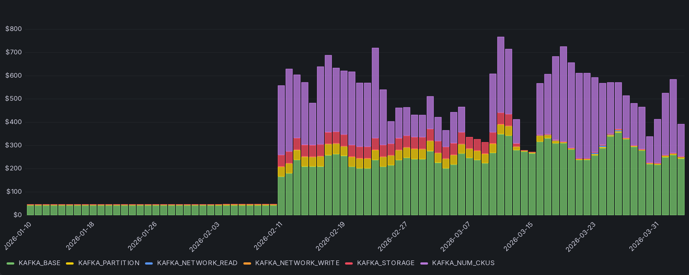
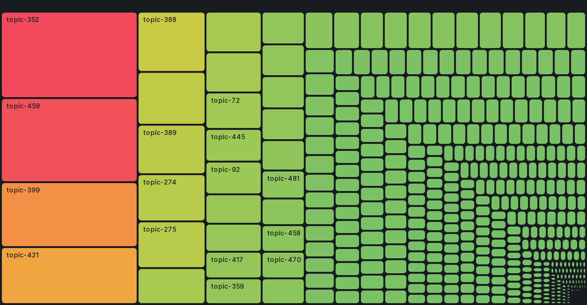
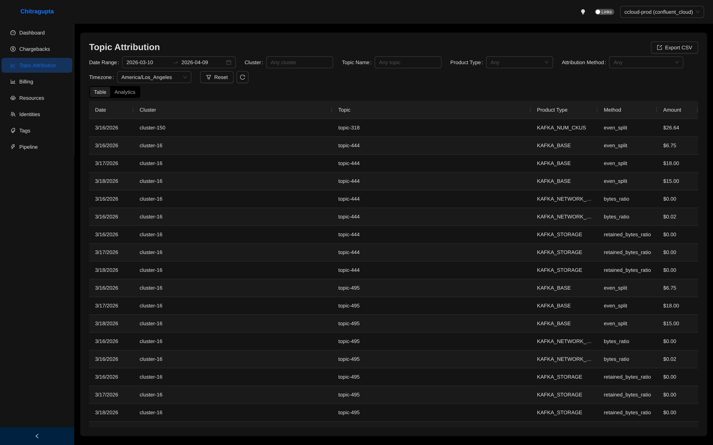
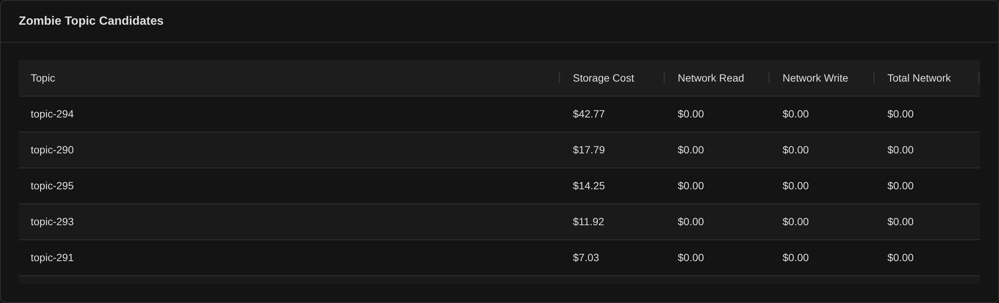

"Which topic is costing us?" is the question every platform team gets, and nobody can answer it cleanly. SaaS providers bill you at the cluster level. Your finance team wants a line item per team. Your product managers want to know if their pipeline is the expensive one. You have a Kafka cluster, a bill, and no bridge between them.

The usual answer is "**we'll figure it out later.**" Later never comes.

Chitragupta has had cluster-level chargeback since day one. But cluster-level only helps when identity-level costs are all you need. It doesn't tell you which topic is the most expensive. Topic attribution in Chitragupta v2.1.0 tries to close that gap by distributing the cluster specific costs to individual topics.

This post is about what it actually takes to distribute a Kafka bill to individual topics without losing a cent.

## The metrics that matter

You can't just split a cluster bill evenly across topics. A topic carrying 80% of the bytes should carry 80% of the cost, not 1/N. The moment one team sees the bill, they notice. Usage-based attribution means metrics, and Confluent Cloud exposes three relevant ones through its Prometheus scrape endpoint:

```python
_DEFAULT_METRIC_NAMES = {
    "topic_bytes_in":       "confluent_kafka_server_received_bytes",
    "topic_bytes_out":      "confluent_kafka_server_sent_bytes",
    "topic_retained_bytes": "confluent_kafka_server_retained_bytes",
}

_QUERY_TEMPLATES = {
    "topic_bytes_in":       "sum by (kafka_id, topic) ({metric_name}{})",
    "topic_bytes_out":      "sum by (kafka_id, topic) ({metric_name}{})",
    "topic_retained_bytes": "sum by (kafka_id, topic) ({metric_name}{})",
}
```

Each Confluent product category maps to one or more of these:

- **Networking (write)**: `bytes_in`
- **Networking (read)**: `bytes_out`
- **Storage**: `retained_bytes`
- **CKU (compute)**: `bytes_in + bytes_out` combined
- **Partition count / base infra**: no per-topic signal, always even-split

All three queries share the same `sum by (kafka_id, topic)` shape. That's a label aggregation: it collapses every label except `kafka_id` and `topic` into one value per topic per scrape time. It does not reduce across time. Each query runs in range mode, so what comes back is a series of points per topic across the billing window.

The time-axis reduction happens in application code after the fetch, and it's different per metric. `bytes_in` and `bytes_out` are delta gauges: each scrape is the value for the reporting interval since the previous one, so summing every scrape across the window gives you the total bytes for the window. `retained_bytes` is a point-in-time gauge: each scrape is the current retained bytes, so the system takes the max across the window. Mixing the two reductions produces garbage attribution.

That said, the max reduction for `retained_bytes` is itself a time-slice approximation, not a clean answer. A topic that holds 100 GB for one hour and then drops to zero for the next twenty-three looks identical to a topic that holds 100 GB steadily for a full day, even though the second one accrued twenty-four times more storage cost. It over-attributes spiky topics and under-attributes sustained ones. Whether it actually matters depends on how the upstream provider meters storage billing (peak retained bytes vs. time-integrated GB-hours). I have thoughts on switching this to a time-integrated reduction once I've validated them against real bills. For now, simplicity wins. Consider this a known limitation.

The metric names and the product-type-to-method mapping are both defaults, not hardcoded. `metric_name_overrides` lets you point at a different exporter naming convention. `cost_mapping_overrides` lets you swap the method per product type, or disable one entirely. If you need an extension point that isn't there, open an issue. Happy to wire it in.

Once it's all wired up, the daily breakdown by product category looks like this:



Each color is a product category. Each bar is a day. Every dollar in the bars on the right is now traceable down to the topic that generated it.

Look at the left half of the chart. I hadn't wired up the Prometheus scrape target in this environment until early February. No metrics source means nothing for the topic attribution overlay to query, so the metric-driven product types produced no rows at all. The one category that survives the gap is `KAFKA_BASE`: it's bound to even-split by definition, no metrics needed, because a cluster-fixed cost has no per-topic signal to begin with. Once the scrape went online, the rest of the bill became traceable.

That's not the only failure mode. We'll come back to what happens when Prometheus is reachable but a topic has no data, and what happens when Prometheus stops answering at all.

## The math

For each topic, divide its bytes by total bytes, multiply by the cluster cost. A topic at 40% of `bytes_in` gets 40% of the networking-write cost. You multiply, you assign, you move on. Except when you run into the remainder problem. I ran into this pretty early on with the Chargeback implementation and I reused the same logic to split the cost here as well.

`$10.00 / 3 topics` is `$3.333...` repeating. Python's `Decimal` at four places of precision rounds each topic to `$3.3333`. Three of those sum to `$9.9999`. You just lost a hundredth of a cent. Do that across 50 clusters every day and finance notices.

The fix was to simply track the gap and redistribute it:

```python
_CENT = Decimal("0.0001")

def _distribute_remainder(amounts, diff):
    """Distribute rounding remainder one cent at a time, round-robin."""
    if diff == 0:
        return amounts
    step = _CENT if diff > 0 else -_CENT
    idx = 0
    for _ in range(len(amounts) * 2):
        amounts[idx] += step
        diff -= step
        idx = (idx + 1) % len(amounts)
        if diff == 0:
            break
```

After rounding each amount, compute the difference from the expected total, then hand out the residual one cent at a time until it's gone. The first few topics get a fraction more, but at $0.0001 per cent the bias is too small to argue about. The sum always matches the input. This is the "no money silently lost" invariant. Every test in the topic attribution suite asserts `sum(amounts) == cluster_cost`.

And here's the payoff:



Each rectangle is a topic. Each rectangle's area is its share of the bill. The handful of large topics on the left are exactly the ones the platform team wants to have a conversation about. The hundreds of small ones on the right are noise that previously got bundled into "platform overhead."

## The edge cases

This is the part that takes the most code.

**A topic has zero metric data.** Prometheus answered the query but returned nothing for that topic. Maybe it had no traffic during the window, maybe its metrics never made it through. The fallback chain catches this: if the usage-ratio model returns nothing, a missing-metrics fallback kicks in and either even-splits across the zero-usage topics or skips them entirely, based on config:

```yaml
topic_attribution:
  missing_metrics_behavior: even_split   # or skip
```

The choice the system makes for each row is recorded as a first-class column in the attribution data:



Notice the `Method` column. `bytes_ratio` is the usage-ratio path firing on `bytes_in`/`bytes_out` data. `retained_bytes_ratio` is the same path firing on the storage gauge. `even_split` shows up in two distinct situations. For `KAFKA_BASE` and `KAFKA_PARTITION`, it's the only model: those are cluster-fixed costs with no per-topic metric, so they get split equally by definition. For the metric-driven types (`KAFKA_NETWORK_*`, `KAFKA_STORAGE`, `KAFKA_NUM_CKU`), `even_split` only shows up as the fallback when the underlying metric was missing for that period. Either way, every row carries its own attribution method, so when finance asks "why did this topic get this number?" the answer is one column away.

**A topic appeared mid-window.** It's in the Prometheus metrics but not in the resources table at window start, or the other way around. Chitragupta takes the union of both sources. Topics from the resources table during `[b_start, b_end)` get included. Topics that showed up in any metric result get included too. Union catches both directions: topics that existed but had no traffic (and fall through to even-split), and topics that showed up in metrics but weren't yet tracked in the resource catalog.

**A topic was deleted before the window.** The resource query is point-in-time, scoped to the billing window. Deleted topics naturally drop out.

## The sentinel pattern: when Prometheus is down

You've computed the chargeback, you're ready to distribute costs to topics, and Prometheus throws a 503. Now what?

This is different from the missing-metrics case above. When Prometheus answered the query and returned nothing, the absence of data was a signal: those topics genuinely had no traffic, and even-splitting is honest. When Prometheus doesn't answer at all, you have no signal. There's nothing to fall back to.

So you have three bad options:

1. **Drop the billing line.** You lose the cost entirely. Never acceptable.
2. **Fall back to even-split anyway.** You paper over the outage with a guess. Your attribution numbers look clean but they're invented, and nothing in the data tells you that.
3. **Retry forever.** Your pipeline stalls on a permanent outage.

Chitragupta does none of these. The pattern I went with is: retry up to a configurable limit (default 3, range 1 to 10), and if Prometheus is still unreachable after the last attempt, write a sentinel row:

```python
TopicAttributionRow(
    topic_name="__UNATTRIBUTED__",
    attribution_method="ATTRIBUTION_FAILED",
    amount=Decimal(str(line.total_cost)),   # full cost preserved
    metadata={
        "error": "Prometheus metrics permanently unavailable",
        "cluster_id": cluster_id,
        "topic_attribution_attempts": attempts,
    },
)
```

The full cluster cost sits in a single row with a synthetic topic name and an explicit attribution method. When you query topic attribution later, you can filter out `ATTRIBUTION_FAILED` rows for per-topic views, or include them to reconcile against the cluster bill.

No money is silently lost. Nothing is silently faked. The outage becomes a first-class row in the data, with enough metadata to find the cluster, count the attempts, and page someone.

The retry counter lives on the billing line itself. Every run that can't reach Prometheus increments it. Once every line for the date is at the limit, the whole date resolves to sentinel rows and the pipeline moves on. Until then, the date stays pending and gets retried on the next run. Partial failures don't mark the date as calculated, so a bad cluster can't poison a good one.

## Zombie topics: the bonus question

Once you have per-topic cost, a new question becomes answerable: which topics are you paying to store for no reason? These are the topics that should have been potentially deleted months ago. Someone ran an experiment, abandoned it, left the topic behind, and you've been quietly paying to retain its data ever since. Nobody notices because the storage cost for any one topic is tiny. Add up 400 of them and it isn't.

Chitragupta's analytics tab calls these "Zombie Topic Candidates" and the logic is about as simple as it gets:

```typescript
const ZOMBIE_THRESHOLD = 0.01;

topics
  .filter((t) => t.kafka_storage > 0 && t.total_network < ZOMBIE_THRESHOLD)
  .sort((a, b) => b.kafka_storage - a.kafka_storage);
```

Non-zero storage cost (you're paying to keep it), near-zero network cost (nobody is touching it). Sort by storage descending, and the most expensive zombies float to the top.



Five topics on this page alone, $94 of storage cost between them, zero traffic. None of them should still exist.

This is twenty lines of frontend code, not a backend feature. It works because the topic attribution table already has per-topic per-product-type cost rows. Ask a new question with a filter and a sort, and the answer falls out. I'm a big proponent of this pattern: build the data layer right, and new features come comparatively cheap. More on how that data layer is structured in the next post.

By the way, this is not to say that all the topics that will show up on this list are actually zombies. Some of them might be legitimate topics that are just not being used at the moment. But it's a good starting point to identify topics that are worth investigating further. Don't go in and burn the place down, just cuz a dashboard told you to.

## What's next

Topic-level attribution ships in Chitragupta v2.1.0. The minimum config to turn it on, assuming you already have CCloud chargebacks running:

```yaml
plugin_settings:
  metrics:
    type: prometheus
    url: "${PROMETHEUS_URL}"
  topic_attribution:
    enabled: true
    missing_metrics_behavior: even_split
```

One new block. The `metrics` block already existed for the chargeback codebase and is marked mandatory for topic attribution to work. It points at any Prometheus that scrapes the Confluent Cloud Metrics API. The `topic_attribution` is the new block that flips the overlay on. I default to `even_split` for `missing_metrics_behavior` because I'd rather fill a gap with a defensible guess than stare at a blank cell, but `skip` is there too if you'd rather see the holes. Pick your poison. Full field reference is in [`docs/configuration/ccloud-reference.md`](https://github.com/waliaabhishek/chitragupta/blob/main/docs/configuration/ccloud-reference.md).

The design decisions in this post aren't the glamorous part of the feature. "I added a retry counter" doesn't show well in release notes. But the sentinel pattern, the remainder distribution, and the union-of-topics strategy are what separate a demo from something you can actually trust your finance team to look at.

Try it. Tell me what breaks. Feel free to reach out.

Next in the series: **Star Schema for Operational Data**, on how the storage layer holds all of this together and why topic attribution gets its own dimensions and facts tables instead of sharing the chargeback schema.
