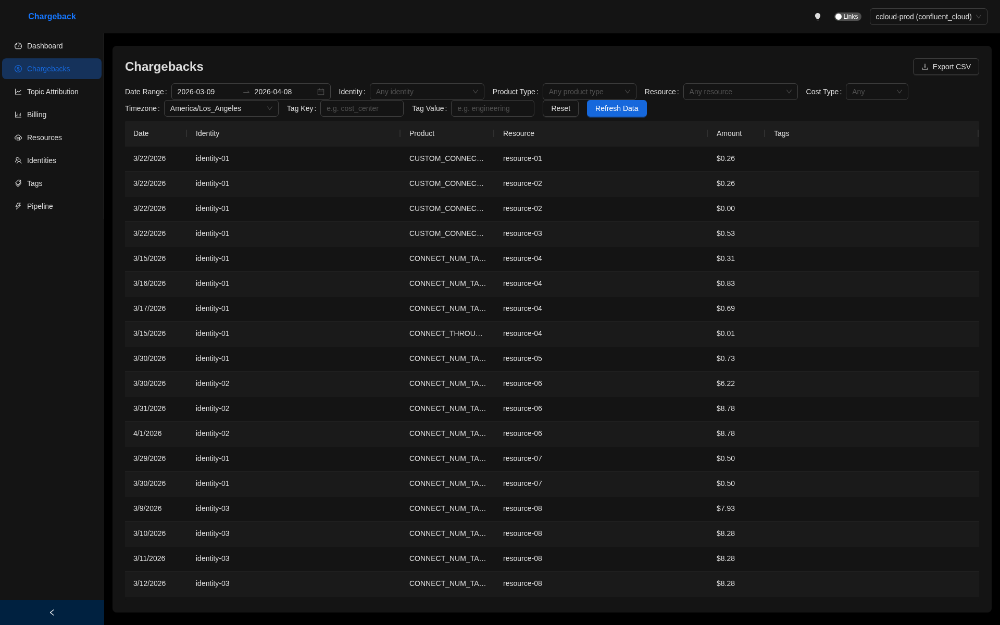
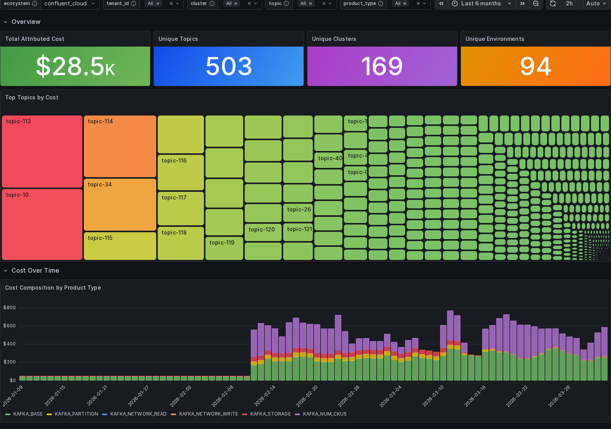
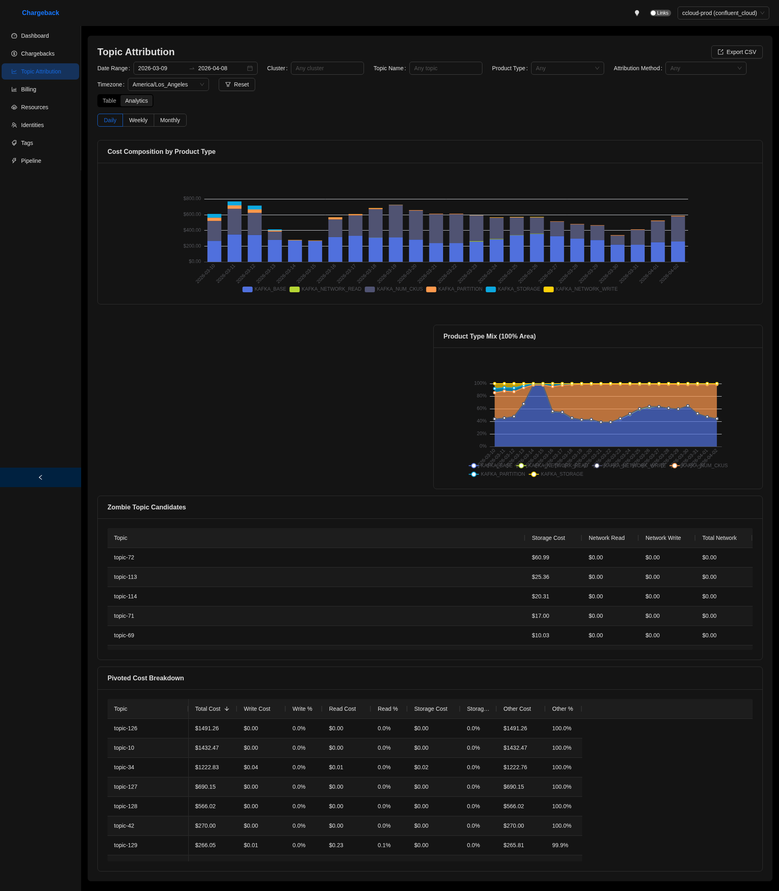

In Hindu tradition, Chitragupta is the deity who maintains a complete record of every being's actions. The divine accountant. Fitting name for a system that tracks exactly who used what and how much it cost.

This is a ground-up rewrite of the [CCloud Chargeback Helper](/projects/ccloud-chargeback-helper/), rebuilt with a full plugin architecture so I can add new ecosystems without touching the core engine every time. It correlates Confluent Cloud Billing, Metrics, and Core Objects APIs to produce hourly, identity-level cost attribution down to service accounts, users, API keys, and individual resources.

The v2 is essentially an entirely new system with a lot more features and a much better performance profile.

## Chargebacks

The whole point of chitragupta is chargebacks. End of the month, finance shows up asking "who owes what", and that question needs a defensible answer. The Grafana dashboard rolls the full Confluent Cloud bill into a single view: total cost, the split between *shared* infrastructure and *usage-driven* cost, a stacked time series broken down by product category (Kafka, Connect, ksqlDB, Flink, Stream Governance, Cluster Linking, Audit Log), and pie charts slicing the same total four ways. The treemap at the bottom is the per-principal view. Every service account, user, and API key gets its own cell sized by how much it cost.

Not everyone wants to stand up Grafana just for this, so chitragupta ships its own UI with the same data behind it. The Chargebacks page is the row-level view: every row is a single line item tying (identity, product, resource) to a dollar amount, plus free-form tags for whatever else finance needs to slice on. Pick your poison on the front-end, the data underneath is the same.

## Topic Attribution

Aggregates are useful right up until someone asks "why is topic X so expensive?". That's what the topic attribution layer is for.

The Grafana topic attribution dashboard gives you the topic-level picture for any cluster or environment: 503 unique topics, $28.5K attributed across them, with the biggest cost centers laid out as a treemap and the cost composition over time stacked by Kafka product type (storage, network read/write, partition count, CKU allocation).

The analytics tab adds two forensic tables. *Zombie topic candidates* lists topics that haven't moved data but are still incurring storage cost. The *pivoted cost breakdown* shows the read/write/storage ratio per topic, so you can tell at a glance where each topic's bill actually comes from. The `attribution_method` column in the underlying rows declares *how* each row's cost was split (`even_split`, `retained_bytes_ratio`, `bytes_ratio`, and so on). **That's the bit that makes the chargeback defensible when someone disputes their bill.**

- [Documentation](https://waliaabhishek.github.io/chitragupta/)
- [Source Code](https://github.com/waliaabhishek/chitragupta)

*Screenshots are from a local deployment. Topic, cluster, environment, resource, and identity strings have been anonymized (`topic-NN`, `cluster-X`, `identity-NN`, `resource-NN`) at capture time via DOM text replacement; all numeric costs, row counts, chart proportions, and time-series shapes are the real values.*
